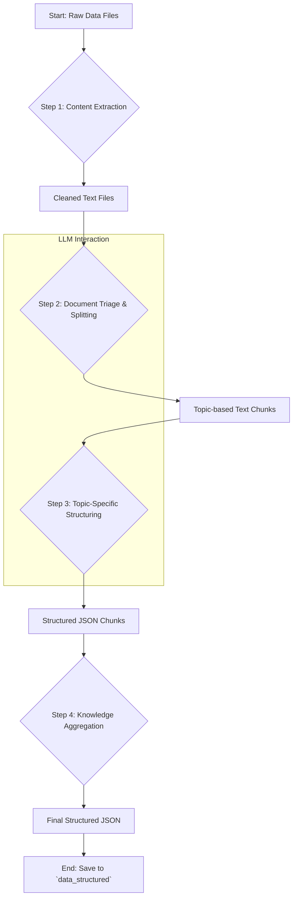

# Part 1: The Knowledge Forge

**Objective:** To convert raw, unstructured and semi-structured web data (HTML, text) into a clean, structured, and topic-segmented JSON knowledge base.

## Features

-   **Automated Content Extraction**: Intelligently extracts the main textual content from raw HTML files, stripping away boilerplate like headers, footers, and navigation bars using the `trafilatura` library.
-   **Advanced Text Normalization**: Cleans the extracted text by normalizing whitespace, removing excessive blank lines, and ensuring a consistent format.
-   **AI-Powered Document Triage**: Uses a Large Language Model (LLM) to analyze the entire document and split it into logical, topic-based chunks (e.g., 'admissions', 'fee_structure', 'scholarship_info').
-   **Topic-Specific Structuring**: Applies a dedicated prompt and a corresponding JSON schema for each identified topic, ensuring that the extracted information is highly structured and relevant.
-   **Resilient Processing**: Incorporates multi-step error handling, including retries with exponential backoff for LLM calls and a dead-letter queue for files that fail processing.
-   **Knowledge Aggregation**: Merges all the structured topic chunks from a single source document into one coherent JSON file, preserving the source context.
-   **Idempotent & Resumable**: The pipeline is designed to be resumable. It checks for already processed files and skips them, allowing you to run it multiple times without duplicating work.

## Pipeline Algorithm and Workflow

The Knowledge Forge pipeline follows a multi-stage process to transform a raw file into a structured JSON object.



### Detailed Algorithm Steps

1.  **Content Extraction (`ContentExtractor`)**:
    -   The pipeline scans the `data_raw` directory (configurable in `config.yaml`) for `.html` and `.txt` files.
    -   For each HTML file, `trafilatura` is used to extract the primary article content, removing ads, navigation, etc.
    -   The extracted (or raw text) content is then normalized to fix excessive whitespace and newlines.
    -   The resulting clean text is saved to a parallel directory structure in `data_cleaned`.

2.  **Document Triage & Splitting (`DocumentSplitter`)**:
    -   The clean text file is read.
    -   An LLM is called with a specialized "triage" prompt (`src/prompts/triage_prompt.txt`) which instructs the model to split the document into logical sections based on predefined topics (e.g., admissions, fees, campus life).
    -   The LLM is expected to return a JSON array where each object contains a `topic` and the corresponding `content`.
    -   If the LLM call fails, the entire document is treated as a single chunk with the topic `general_info`.

3.  **Topic-Specific Structuring (`DataStructurer`)**:
    -   The pipeline iterates through each topic chunk generated in the previous step.
    -   For each chunk, it dynamically selects a corresponding JSON schema (e.g., `fee_schema.json`) from `src/schemas/` and a prompt (e.g., `fee_prompt.txt`) from `src/prompts/`.
    -   The prompt is formatted with the chunk's content and the schema definition, instructing the LLM to extract information according to the specified structure.
    -   This process is wrapped in a retry loop (up to 5 attempts with exponential backoff) to handle transient LLM API errors.
    -   The LLM's response is parsed to extract the JSON content.

4.  **Knowledge Aggregation (`KnowledgeAggregator`)**:
    -   Once all chunks from a source file have been structured, they are collected.
    -   The `KnowledgeAggregator` merges these individual topic-based JSON objects into a single, comprehensive JSON file.
    -   This final object includes metadata, such as the `source_file` name, for traceability.

5.  **Save Output**:
    -   The final aggregated JSON is saved to the `data_structured` directory, with a filename corresponding to the original source file.

## How to Run and Configure

### Running the Pipeline

You can run the Knowledge Forge pipeline in two primary ways:

**1. Using the Central Runner (Recommended):**

This method uses the main `run.py` script, which provides more robust configuration and validation.

```bash
# Ensure you are in the project root directory
# Set up required environment variables (even if dummy values for Vertex)
export GEMINI_API_KEY_1="your_google_ai_studio_key"
export VERTEX_AI_PROJECT="your-gcp-project-id"
export VERTEX_AI_LOCATION="us-central1"
export VERTEX_AI_MODEL="gemini-1.5-pro-preview-0409"

# Run only the cleaning and structuring steps
python3 run.py --mode=production --steps clean structure
```

**2. Using the Standalone Script:**

This is a simpler way to run the structuring part of the pipeline and bypasses the central runner's environment validation. It assumes your raw data is in a directory named `data`.

```bash
# Ensure you are in the project root directory
python3 run_structuring_pipeline.py
```

### Configuration

All configuration for this pipeline is managed in the `config.yaml` file.

-   **`api_providers`**: Configure your LLM API keys and models here. The pipeline uses `APIClientManager` to intelligently rotate through keys, manage rate limits, and prioritize paid tiers.
-   **`data_config`**:
    -   `raw_dir`: The input directory for your raw HTML/text files (default: `data_raw`).
    -   `cleaned_dir`: The output directory for cleaned text files (default: `data_cleaned`).
    -   `structured_dir`: The final output directory for the structured JSON files (default: `data_structured`).
    -   `checkpoint_dir`: Stores checkpoint files to keep track of processed files (default: `checkpoints`).
-   **Prompts & Schemas**:
    -   To add a new topic, you need to create a corresponding `_prompt.txt` file in `src/prompts/` and a `_schema.json` file in `src/schemas/`. The `DataStructurer` will automatically pick them up based on the topic name returned by the triage model.
