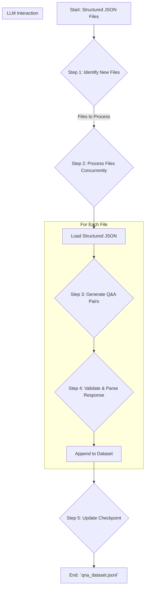

# Part 2: The Q&A Forge

**Objective:** To generate high-quality, instruction-formatted Question-Answer pairs from the structured JSON knowledge base created by Part 1.

## Features

-   **Context-Aware Generation**: Uses the entire structured JSON object for a source file as context, allowing it to generate holistic and well-informed Q&A pairs.
-   **Instruction-Formatted Output**: Generates Q&A pairs that include a direct answer, context, source, and rich metadata, making them ideal for fine-tuning.
-   **High-Throughput Processing**: Processes files concurrently using `asyncio` to maximize efficiency.
-   **Robust Error Handling**: Implements retries with exponential backoff and a dead-letter queue.
-   **Resumable Pipeline**: Uses checkpoints to track progress and resume runs.
-   **Scalable Output**: Appends Q&A pairs to a `.jsonl` file, ideal for large datasets.

## Pipeline Algorithm and Workflow

The Q&A Forge pipeline is designed for efficiency and resilience, turning structured data into a fine-tuning dataset.

### Detailed Algorithm Steps

1.  **Identify New Files**:
    -   The pipeline starts by scanning the `data_structured` directory for all `_structured.json` files.
    -   It then loads the list of already processed files from the checkpoint file (`checkpoints/qa_processed_files.json`).
    -   By comparing the two lists, it creates a queue of new files that need to be processed. If there are no new files, the pipeline exits.

2.  **Process Files Concurrently**:
    -   The pipeline uses `asyncio` to process multiple files in parallel, up to the `concurrency_limit` defined in `config.yaml`.
    -   Each file is processed in a wrapper that includes a semaphore for concurrency control and a retry loop.

3.  **Generate Q&A Pairs (`QAGenerator`)**:
    -   For each file, the structured JSON content is loaded into memory.
    -   The entire JSON object is converted into a formatted string.
    -   This string is then inserted into a prompt template (`src/prompts/qa_generation_prompt.md`). This prompt instructs the LLM to act as an expert and generate a list of relevant Q&A pairs based on the provided context.
    -   An API call is made to the configured LLM.

4.  **Validate & Parse Response**:
    -   The LLM's response is received as a raw string, which may contain markdown formatting or other text around the actual JSON.
    -   A regex parser extracts the JSON array from the response.
    -   The pipeline then validates each item in the array to ensure it matches the required structure: `{ "question": "...", "answer": { "short_answer": "...", "explanation": "..." } }`.
    -   Invalid items are discarded and logged.

5.  **Append to Dataset & Update Checkpoint**:
    -   All valid Q&A pairs generated from the file are appended as new lines to the output file (`data_qa/qna_dataset.jsonl`).
    -   If a file is processed successfully, its name is added to the list of processed files, and the checkpoint file on disk is updated after the run.

