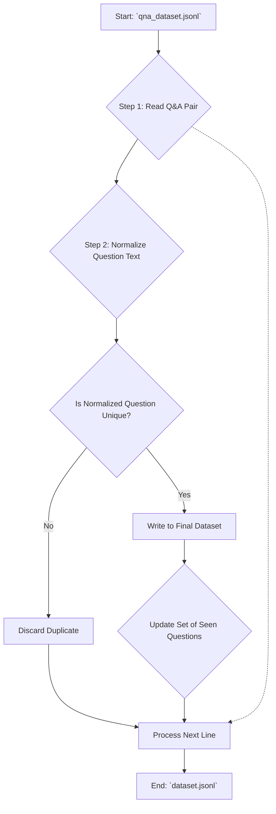

# Part 3: The Quality Assurance Forge

**Objective:** To perform quality control on the generated dataset, ensuring its integrity, removing duplicates, and preparing it for the final fine-tuning process.

## Features

-   **Duplicate Removal**: Identifies and removes duplicate Question-Answer pairs based on the question text, ensuring a more diverse and efficient training dataset.
-   **Text Normalization**: Implements a normalization step (converting to lowercase, removing punctuation) before checking for duplicates to catch semantically identical but textually different questions.
-   **Statistical Reporting**: Provides a clear report after processing, detailing the total number of records, the number of duplicates found, and the final count of unique Q&A pairs.
-   **Standalone & Idempotent**: Designed as a standalone script that can be run independently after the Q&A generation, and it will produce the same output every time given the same input.

## Pipeline Algorithm and Workflow

This final pipeline stage acts as a filter, cleaning the output from the Q&A Forge.



### Detailed Algorithm Steps

1.  **Initialization**:
    -   The pipeline initializes an empty Python `set` named `seen_questions`. A set is used for its highly efficient O(1) average time complexity for checking the existence of an item.

2.  **Read the Dataset**:
    -   The script reads the input file (`data_qa/qna_dataset.jsonl`) line by line. This approach is memory-efficient as it avoids loading the entire dataset into memory.

3.  **Normalize the Question**:
    -   For each JSON record, the `question` text is extracted.
    -   The question is then "normalized" by converting it to lowercase and removing common punctuation marks. This step is crucial for ensuring that questions like "What is the fee?" and "what is the fee." are treated as duplicates.

4.  **Check for Duplicates**:
    -   The normalized question is checked for its presence in the `seen_questions` set.
    -   If the normalized question is **not** in the set, it is considered unique.
    -   If it **is** already in the set, the entire Q&A pair is considered a duplicate and is discarded.

5.  **Write Unique Records**:
    -   If the Q&A pair is unique, two actions are performed:
        1.  The original, un-normalized Q&A pair (as a JSON string) is written to the new output file (`dataset/dataset.jsonl`).
        2.  The normalized question is added to the `seen_questions` set to track it for future comparisons.

6.  **Final Report**:
    -   After processing all lines, the pipeline prints a summary report to the console, detailing the number of total records processed, duplicates removed, and unique records saved.

## How to Run and Configure

### Running the Pipeline

This script is intended to be run after you have a `qna_dataset.jsonl` file generated by Part 2.

```bash
# Ensure you are in the project root directory

# Run the script with default input and output paths
python3 run_quality_assurance.py

# You can also specify custom paths
python3 run_quality_assurance.py --input /path/to/your/dataset.jsonl --output /path/to/your/clean_dataset.jsonl
```

### Configuration

This pipeline is self-contained and does not rely on the `config.yaml` file. Its behavior is controlled entirely through command-line arguments:

-   `--input`: Specifies the path to the dataset you want to clean. Defaults to `data_qa/qna_dataset.jsonl`.
-   `--output`: Specifies the path for the final, deduplicated dataset. Defaults to `dataset/dataset.jsonl`.
