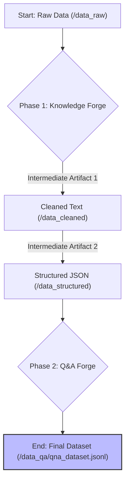

# Research Paper: A Two-Phase Pipeline for High-Quality Dataset Generation

## Abstract

Creating high-quality, domain-specific datasets for fine-tuning Large Language Models (LLMs) is a significant challenge. General-purpose models often lack the nuanced, cultural, and specific knowledge required for specialized tasks. This document details the architecture and methodology of **SetForge**, a two-phase, research-oriented pipeline designed to address this challenge. The pipeline systematically transforms unstructured and semi-structured web data into a structured knowledge base, and then uses that base to generate a high-quality, instruction-formatted Question-Answer dataset for fine-tuning an AI counselor for Bangladeshi students seeking information about Indian universities.

## 1. Introduction

The primary goal of this research is to develop a model that outperforms general-purpose LLMs in a niche domain. This requires a specialized dataset that is clean, structured, contextually rich, and culturally relevant. The SetForge pipeline is engineered to produce such a dataset through a deterministic and reproducible process, minimizing manual intervention and maximizing quality. The pipeline is divided into two core phases:

1.  **Phase 1: The Knowledge Forge**: Focuses on ingesting raw web data, cleaning it, and converting it into a structured, topic-segmented JSON knowledge base.
2.  **Phase 2: The Q&A Forge**: Leverages the structured knowledge base to generate thousands of high-quality, instruction-formatted Q&A pairs suitable for fine-tuning.
3.  **Phase 3: The QA Forge**: Performs deduplication, quality validation, and final packaging into a clean fine-tuning dataset.

## 2. Overall Pipeline Architecture

The end-to-end process is a linear flow that transforms data through several distinct stages, creating intermediate artifacts that can be audited and reused.

## 3. Phase 1: The Knowledge Forge - Methodology

The objective of this phase is to impose a strong, explicit structure on noisy, unstructured web content.

### Step 3.1: Content Extraction and Normalization

-   **Process**: The pipeline begins by scanning the `/data_raw` directory. For each HTML file, it employs the `trafilatura` Python library, a state-of-the-art tool for web content extraction.
-   **Algorithm**: `trafilatura` uses a set of precision-focused heuristics to identify and extract the main content of a webpage, effectively discarding common boilerplate such as navigation bars, headers, footers, advertisements, and social media widgets. This is a critical first step for noise reduction.
-   **Technology**: The core library used is `trafilatura`. Following extraction, Python's built-in `re` module is used to perform text normalization, which involves standardizing whitespace and removing excessive newlines.
-   **Output**: Cleaned, content-focused text files are saved to the `/data_cleaned` directory, preserving the original directory structure for traceability.

### Step 3.2: AI-Driven Semantic Chunking (Triage)

-   **Process**: Instead of using naive, fixed-size chunking, this step uses an LLM to segment the document semantically. The full text of a cleaned file is passed to an LLM with a specific "triage" prompt.
-   **Algorithm**: This is a zero-shot classification and segmentation task. The prompt (`src/prompts/triage_prompt.txt`) instructs the LLM to analyze the document and split it into logical chunks based on predefined topics relevant to the project's domain (e.g., `admission_info`, `fee_structure`, `scholarship_info`). The model returns a JSON array of these topic-tagged chunks. This approach ensures that subsequent steps operate on contextually coherent blocks of text.
-   **Technology**: The `APIClientManager` utility handles resilient, rate-limited calls to the configured Google AI Studio API.

### Step 3.3: Topic-Centric Information Extraction

-   **Process**: Each topic-tagged chunk from the previous step is processed individually. A corresponding JSON schema (e.g., `fee_schema.json` from `/src/schemas/`) and a specialized extraction prompt (e.g., `fee_prompt.txt` from `/src/prompts/`) are dynamically loaded.
-   **Algorithm**: This step performs schema-guided information extraction. The LLM is prompted with the text chunk, the desired JSON schema, and instructions to extract entities and information that conform to that schema. This heavily constrains the LLM's output, leading to highly consistent and predictable structured data. The process is wrapped in a resilient loop with exponential backoff to handle transient API failures.
-   **Technology**: The `APIClientManager` makes the LLM call. The `json` library is used to parse the response, and an optional (but recommended) validation against the schema can be performed using the `jsonschema` library.

### Step 3.4: Knowledge Aggregation

-   **Process**: The structured JSON objects from all chunks of a single source file are aggregated into a final, unified JSON document.
-   **Algorithm**: A simple dictionary merge operation combines the topic-based chunks under a single `structured_data` key, with metadata like the `source_file` name added for provenance.
-   **Output**: The final structured JSON files are saved in the `/data_structured` directory.

## 4. Phase 2: The Q&A Forge - Methodology

The objective of this phase is to transform the structured knowledge base into an instruction-formatted dataset ready for LLM fine-tuning.

### Step 4.1: Context-Aware Q&A Generation

-   **Process**: The pipeline reads a structured JSON file from the `/data_structured` directory. The entire JSON object is serialized into a string.
-   **Algorithm**: This serialized string is embedded into a master prompt (`src/prompts/qa_generation_prompt.md`), providing the LLM with the complete context of the source document. This "full-context" approach allows the model to generate holistic Q&A pairs that can synthesize information across different topics within the document, leading to higher-quality and more comprehensive questions and answers. The prompt explicitly instructs the model to generate a JSON array of Q&A pairs.

### Step 4.2: Instruction Formatting and Validation

-   **Process**: The LLM is instructed to format each answer as a nested JSON object containing a `short_answer` and a detailed `explanation`.
-   **Algorithm**: This structure is ideal for instruction fine-tuning, as it teaches the model to provide both a concise response and a thorough elaboration. Upon receiving the response from the LLM, a robust parser (`src/utils/json_parser.py`) uses regular expressions to isolate the JSON array from any extraneous text, and the `json` library decodes it. The pipeline then validates that each item in the array conforms to the expected Q&A structure.

### Step 4.3: Asynchronous Processing and Scalable Output

-   **Process**: To handle a large volume of structured files efficiently, the pipeline leverages asynchronous programming.
-   **Algorithm**: Using Python's `asyncio` library, the pipeline processes multiple files concurrently, making non-blocking API calls. This dramatically reduces the total runtime, which would otherwise be dominated by network latency. All validated Q&A pairs are appended to a single output file, `qna_dataset.jsonl`, in the `/data_qa` directory. The `.jsonl` (JSON Lines) format is used, where each line is a separate JSON object. This format is highly scalable and allows for efficient, line-by-line reading of massive datasets without loading the entire file into memory.

## 5. Core Technologies & Libraries

-   **Python 3.9+**: The core programming language.
-   **`asyncio` & `aiohttp`**: For high-performance, concurrent API calls.
-   **`trafilatura`**: For state-of-the-art web content extraction.
-   **`PyYAML`**: For managing the centralized `config.yaml` file.
-   **`jsonschema`**: For validating the structured data against predefined schemas.
-   **`re` (Regular Expressions)**: For robustly parsing LLM responses and normalizing text.

## 6. Research Implications and Conclusion

The SetForge pipeline presents a robust, scalable, and reproducible methodology for creating high-quality, domain-specific datasets for LLM fine-tuning. Its key innovations include:

1.  **Two-Phase LLM Interaction**: Using a preliminary LLM call for semantic chunking (triage) before making more specialized, schema-guided extraction calls. This hierarchical approach improves the quality and relevance of the final structured data.
2.  **Full-Context Q&A Generation**: Providing the entire structured document as context for Q&A generation, resulting in more comprehensive and less fragmented questions and answers.
3.  **Resilient and Asynchronous Architecture**: Ensuring that the pipeline can run reliably and efficiently at scale, handling thousands of documents and API calls.

By following this structured, multi-stage process, the SetForge pipeline is capable of generating a dataset that can effectively imbue a base LLM with the specialized knowledge and cultural context required to function as an expert AI counselor.
